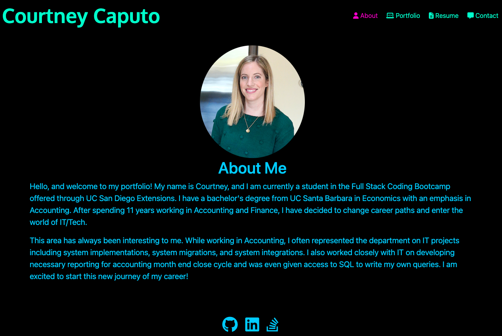
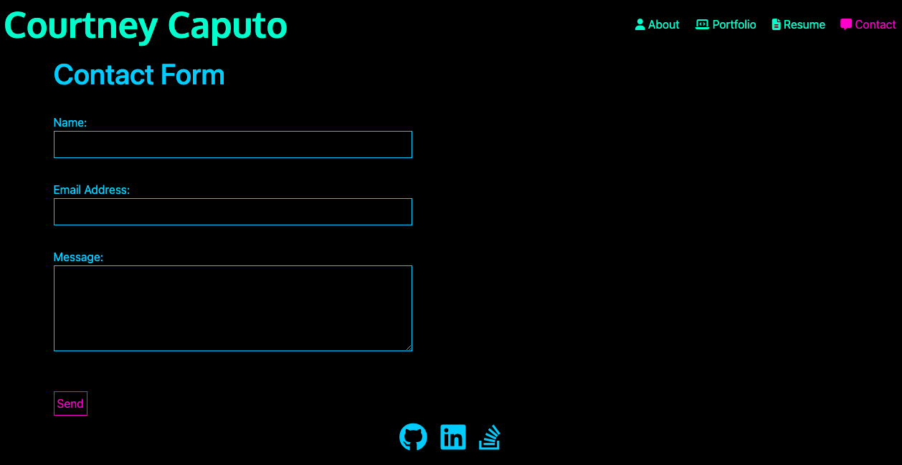

# React Portfolio

 

## Table of Contents
- [Description](#description)
- [Installation](#installation)
- [Usage](#usage)
- [License](#license)
- [Contributing](#contributing)
- [Tests](#tests)
- [Questions](#questions)
    
## Description: 
This project was to create a portfolio using React. In this portfolio, it has sections for about me, resume, projects, and a contact page.

## Installation Instructions: 
To install the necessary dependencies, run the following command in terminal once the respository has been cloned: `npm install`. 

## Usage Information: 
To run this application locally, run the following command in terminal `npm start`

<a href="https://drive.google.com/file/d/1YXoDNfoG6729-jCSK82BqJt6UFksZdjv/view" target="blank">Demo Video</a>

## License: 
This project is licensed under the MIT license.

## Contribution Guidelines: 
There are currently no contribution guidelines.

## Test Instructions: 
There are currently no tests.

## Questions: 
If you have questions regarding this project, you can contact me directly at:
* Github: <a href="https://github.com/courtneycaputo">courtneycaputo</a>
* Email: <a href="mailto:courtneycaputo@gmail.com">courtneycaputo@gmail.com</a>